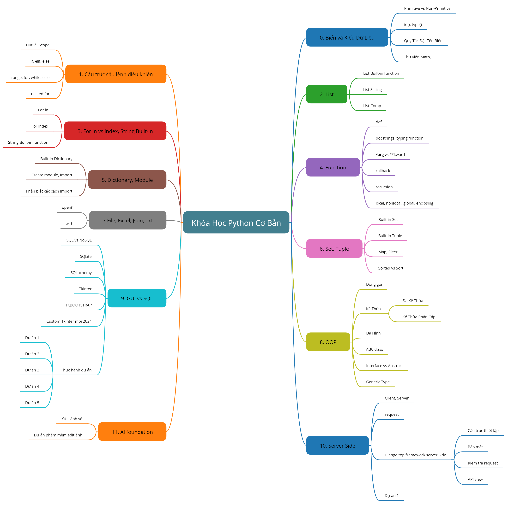
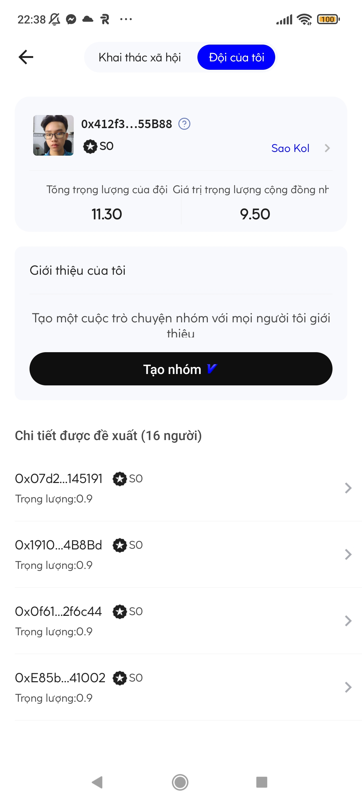
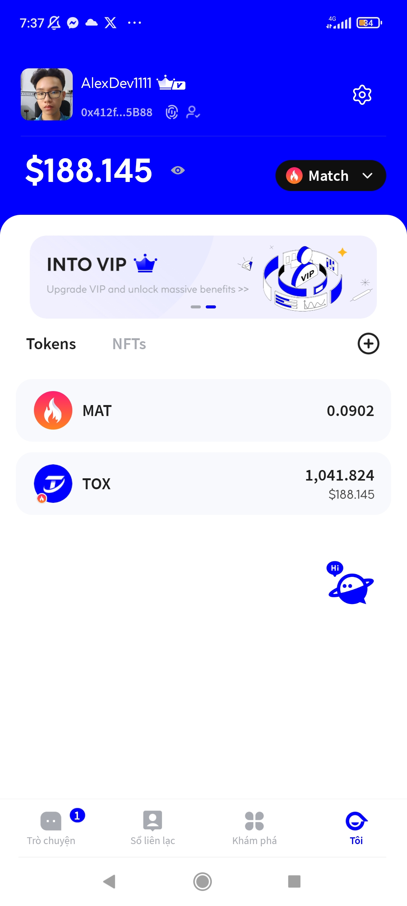
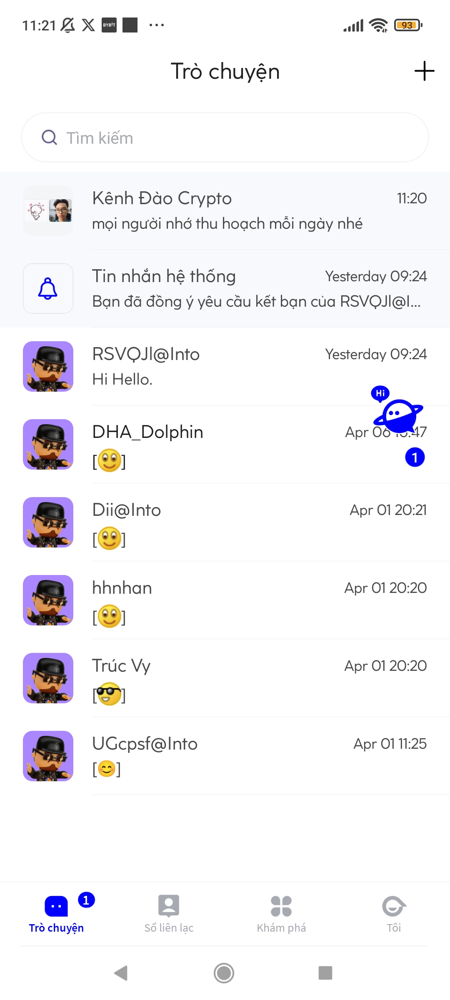
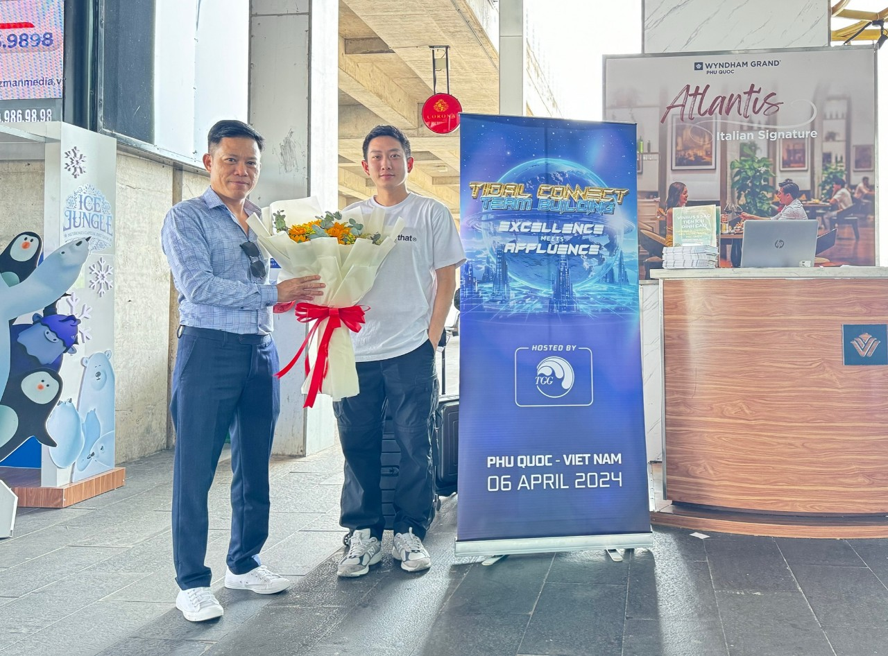
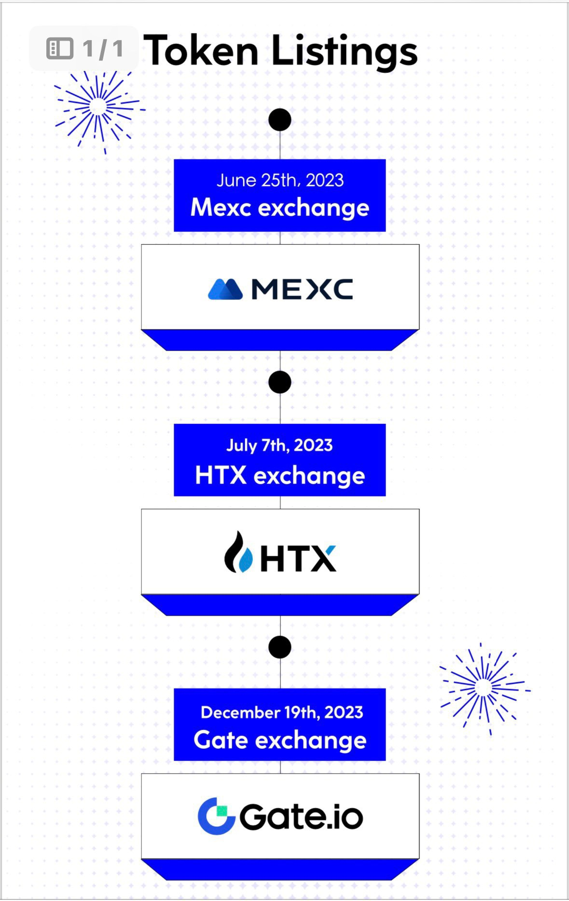
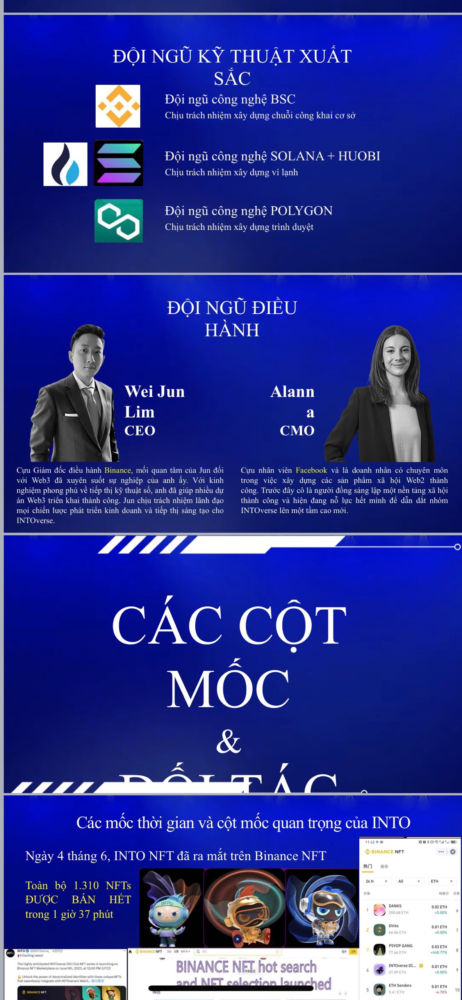
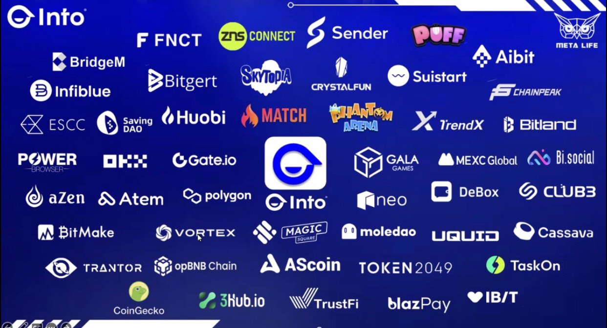

# Admin Dashboard Đẹp và Tiện Lợi 2024

<br>
<br>
<br>
<br>

## Kiến thức cần chuẩn bị
> __Python Cơ Bản__ [Bấm vào đây](https://www.youtube.com/watch?v=vuW_VP45HAw&list=PL0BKQObQ3LnDhMKXnId86lj_lBqByA1ON)
> __OOP_Python__ [Bấm vào đây](https://www.youtube.com/watch?v=vuW_VP45HAw&list=PL0BKQObQ3LnDhMKXnId86lj_lBqByA1ON)
> __Django_Module, MVT, Bolerate Tag Dj, Recycling__ [Bấm Vào Đây](#khóa-học-fullstack-python)
> __Video Hướng Dẫn__ [Bấm vào đây]()


### Thiết Lập Cho Dự Án
Dùng câu lệnh sau cho terminal:
```sh
pip install -r requirements.txt
py manage.py makemigrations
py manage.py migrate
```

### Chạy Dự Án
Dùng câu lệnh sau cho terminal:
```sh
py app.py runserver
```

### Tạo ứng dụng Admin Dashboard

1. **Tạo ứng dụng Django**:
   Mở terminal và chạy lệnh sau để tạo một ứng dụng Django mới có tên là `project_core`:
   ```bash
   python manage.py startapp project_core
   ```

2. **Cập nhật INSTALLED_APPS**:
   Mở file `settings.py` trong dự án Django của bạn và thêm `'project_core.apps.AdminDashboardConfig',` vào danh sách `INSTALLED_APPS`.

3. **Cài đặt Template cho Trang chủ Admin**:
   - Tạo một file mới có đường dẫn `templates/admin/index.html` trong thư mục gốc của dự án Django.
   - Cập nhật các thiết lập của template trong `settings.py`:
     ```python
     TEMPLATES = [
         {
             "BACKEND": "django.template.backends.django.DjangoTemplates",
             "DIRS": [BASE_DIR / "templates"],
             "APP_DIRS": True,
             ...
         },
     ]
     ```

4. **Thêm nội dung vào Template**:
   - Copy và dán nội dung sau vào file `index.html`:

     (Nội dung được cung cấp trong nguồn tài liệu).

### Tailwind CSS

5. **Cấu hình Tailwind CSS**:
   - Tạo một file mới có tên `tailwind.config.js` trong thư mục gốc của dự án.
   - Copy và dán nội dung cấu hình Tailwind CSS vào file vừa tạo.

6. **Biên dịch Tailwind CSS**:
   - Chạy lệnh sau trong terminal:
     ```bash
     npx tailwindcss -o <django_project_dir>/project_core/static/project_core/css/styles.css --watch --minify
     ```
   - Thay `<django_project_dir>` bằng đường dẫn thư mục dự án của bạn.

### Xây dựng Nội dung Dashboard

7. **Cập nhật Context cho Dashboard**:
   - Trong file `provider.py` của ứng dụng `project_core`, thêm một hàm mới `dashboard_callback` để cung cấp context cho trang dashboard.
   - Sao chép và dán nội dung hàm `dashboard_callback` từ nguồn tài liệu.

8. **Cập nhật Thiết lập Unfold**:
   - Trong file `settings.py`, cập nhật thiết lập Unfold như sau:

     ```python
     UNFOLD = {
         ...
         "DASHBOARD_CALLBACK": "project_core.views.dashboard_callback",
         "STYLES": [
             lambda request: static("project_core/css/styles.css"),
         ],
         ...
     }
     ```

Với các bước trên, bạn đã có thể tạo ứng dụng Admin Dashboard trong Django và tích hợp Tailwind CSS để tạo giao diện đẹp mắt.

<br>
<br>
<br>
<br>

## KHóa Học Fullstack Python

__Hình Thức:__
- Qua Video
- Qua Zoom, Discord, Classin,...

__Khóa Học Video:__
> Hơn 60 giờ học + Tải về + Cập nhật và sử dụng trọn đời
> Video hướng dẫn 7 dự án + Code
> Tài liệu biên soàn bản đầy đủ [Bấm vào đây xem bản dùng thử](https://github.com/8syncdev/Full-Python-Ebook)
> __Giá Gốc: 1.200.000đ__, __Giá Hiện Tại: 400.000đ__ đến hết 11/5/2024
> Website Lý Thuyết và Bài Tập (Sắp ra mắt nên đăng kí trước khi hết khuyến mãi)

__Khóa Học Zoom:__
> Liên hệ 0703930513

[Bấm vào đây xem chi tiết hình ảnh](./doc/images/RoadMap.png)



<br>
<br>
<br>
<br>

### Dự án Web 3 Free + Blockchain + NFT
> Liên hệ vào team để khai phá tiềm năng dự án, được tham gia traning để có kiến thức làm việc chung với nhóm.

> Thu nhập thụ động sinh lời theo thuật toán APR của blockchain.

> Chỉ cày khi dự án mới khởi động và sẽ khó bước chân vào khi dự án đã lớn mạnh như BITCOIN.

### Hình ảnh về cộng đồng và đội ngũ dự án.

__Team của 8 Sync DEV__













### Hội Nghị CEO các nước đã cập bến Việt Nam

[Bấm vào để xem chi tiết dự án](./doc/video/intro.mp4)
[Bấm vào để xem chi tiết CEO Binance quỹ đầu tư lớn của BITCOIN tới Việt Nam](./doc/video/ceo.mp4)

> Tham gia dự án sớm liên hệ: 0703930513

